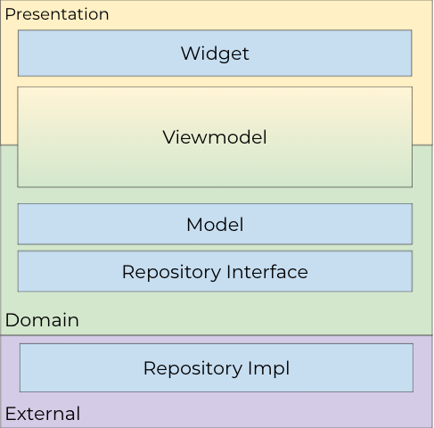

# marketplace

A Marketplace App example with GraphQL, flutter_bloc and automated testing(unit and widget).

## Getting Started

This project is a starting point for a Flutter application.

So you need Flutter installed and configured in your machine.

You can follow this documentation:
- [Install Flutter](https://flutter.dev/docs/get-started/install)
- [Learn Flutter](https://flutter.dev/docs)

## App Architecture

It's a MVVM using some principles of SOLID to make the application flexible.

Here's an overview of the layers:


Viewmodel is between two layers because it's the glue between Presentation and Domain.

## Libraries
- **State Management**: *flutter_bloc* is a battle-tested library with a lot of support, also bring us consistency with a well-defined pattern that you'll find across our app.
- **GraphQL Client**: *graphql* is the most popular library.
- **Dependency Injection**: *provider* is the easiest way to inject objects in our widget tree, also follows the principles of Flutter, which is familiar to the most part of developers.
- **Object Equality**: *equatable* make us avoid the pain of overriding hashcode and equals manually to achieve equality by values. 
- **Testing**: *mocktail* is the substitute of Mockito for Null Safety applications, it brings all the principles of Mockito which is familiar and make easy to migrate Non Null Safety Applications. 
*bloc_test* make our life easier with testing bloc, also creates a well-defined pattern that brings consistency for our test cases.

## Testing

Our test coverage is a mixing between unit and widget testing.

**To run**:
```
flutter test
```
**To check coverage**(you'll need lcov):
```
rm -rf coverage/ && flutter test --coverage && sleep 2 && genhtml -o coverage coverage/lcov.info
```
This command will generate the coverage report and also print the coverage in the console.

You can learn more about Widget Testing here:
- [Introduction to Widget Testing](https://flutter.dev/docs/cookbook/testing/widget/introduction)
- [Widget Testing: Dealing with dependencies](https://medium.com/flutterando/widget-testing-dealing-with-dependencies-c429fc90a9b5)

## Running

**Debug**
```
flutter run
```

**Release**
```
flutter run --release
```

**Profile**
You want to run in profile mode to check the performance.

Follow this documentation:
- [Flutter Performance Profiling](https://flutter.dev/docs/perf/rendering/ui-performance) 

## Building and Release

Follow this documentation to build and release:
- [Android](https://flutter.dev/docs/deployment/android)
- [iOS](https://flutter.dev/docs/deployment/ios)
- [Linux](https://flutter.dev/docs/deployment/linux)
- [Web](https://flutter.dev/docs/deployment/linux)


